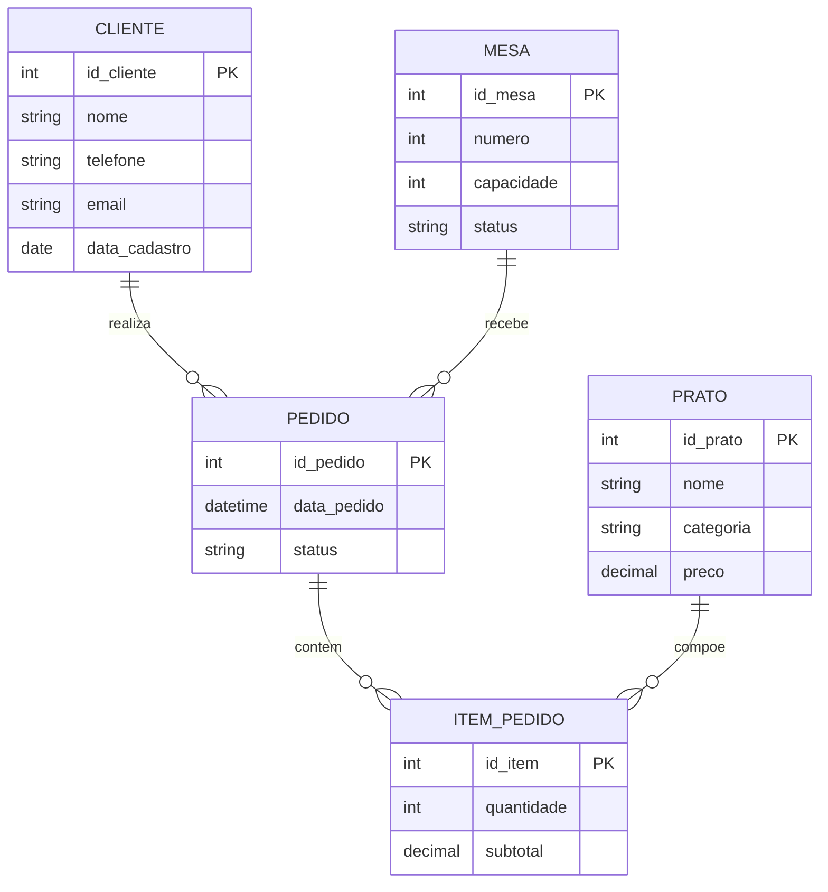

# Diagrama Conceitual — Sistema Restaurante

Modelo entidade-relacionamento para reprodução no [brModelo](https://www.sis4.com/brModelo/).

## Diagrama

## Entidades e atributos

| Entidade | Atributos | Identificador |
|----------|-----------|---------------|
| CLIENTE | nome, telefone, email, data_cadastro | id_cliente |
| MESA | numero, capacidade, status | id_mesa |
| PRATO | nome, categoria, preco | id_prato |
| PEDIDO | data_pedido, status | id_pedido |
| ITEM_PEDIDO | quantidade, subtotal | id_item |

## Relacionamentos

| Relacionamento | Cardinalidade | Descrição |
|----------------|---------------|-----------|
| CLIENTE — PEDIDO | 1:N | Um cliente pode fazer vários pedidos |
| MESA — PEDIDO | 1:N | Uma mesa pode receber vários pedidos |
| PEDIDO — ITEM_PEDIDO | 1:N | Um pedido contém vários itens |
| PRATO — ITEM_PEDIDO | 1:N | Um prato pode compor vários itens de pedido |

## Como exportar no brModelo

1. Acesse https://www.sis4.com/brModelo/ e crie um novo modelo.
2. Adicione as 5 entidades com os atributos da tabela acima.
3. Sublinhe os identificadores (PK).
4. Conecte os relacionamentos com cardinalidade **1:N**.
5. Menu **Arquivo → Exportar → PNG** (ou use print da tela).
6. Salve como `diagrama_conceitual.png` para anexar ao trabalho.

## Visualização alternativa

Abra [`visualizar.html`](visualizar.html) no navegador para ver o diagrama renderizado e tirar print.
