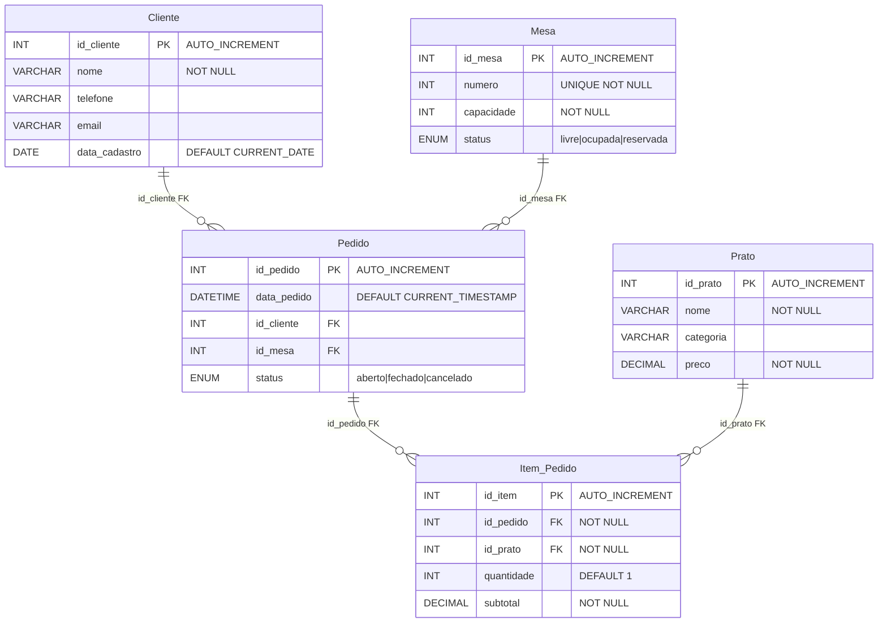

# Diagrama Lógico — Sistema Restaurante

Modelo relacional correspondente ao banco `restaurante` (MySQL 8.0).

## Diagrama

## Chaves e restrições

| Tabela | Chave primária | Chaves estrangeiras |
|--------|----------------|---------------------|
| Cliente | id_cliente | — |
| Mesa | id_mesa | — |
| Prato | id_prato | — |
| Pedido | id_pedido | id_cliente → Cliente, id_mesa → Mesa |
| Item_Pedido | id_item | id_pedido → Pedido, id_prato → Prato |

## Como gerar no MySQL Workbench

1. Certifique-se de que o banco existe (`.\setup.ps1` na raiz do projeto).
2. Abra o **MySQL Workbench** e conecte em `localhost` (usuário `root`).
3. Menu **Database → Reverse Engineer…**
4. Selecione a conexão e o schema **`restaurante`**.
5. Marque todas as 5 tabelas e conclua o assistente.
6. O diagrama EER será gerado com PKs e FKs.
7. Menu **File → Export → Export as PNG** (ou PDF).
8. Salve como `diagrama_logico.png` para anexar ao trabalho.

## Visualização alternativa

Abra [`visualizar.html`](visualizar.html) no navegador para ver o diagrama renderizado e tirar print.
